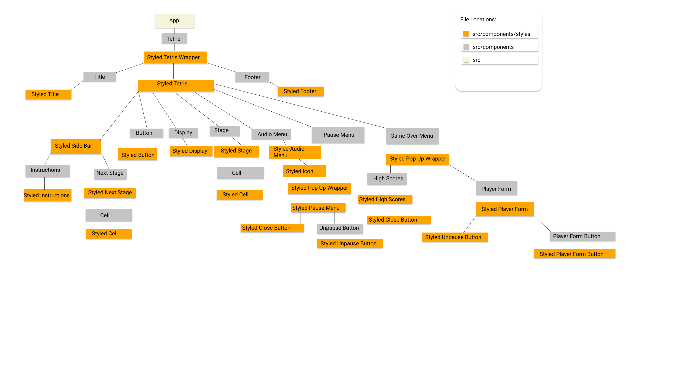

# TETRIACT

## What is TETRIACT?
TETRIACT is a Web-Based Tetris emulator built in a an arcade style.

A user can play the game, save their gamertags and scores, and see where they rank in the top ten.

***

## Table of Contents
- [Motivation](#motivation)
- [Component Hierarchy](#component-hierarchy)
- [Demo](#demo)
- [Installation](#installation)
- [Technologies Used](#technologies-used)
- [Future Updates](#future-updates)
- [Special Thanks](#special-thanks)

---
### Motivation
I have always been a big fan of tetris and wanted to attempt to build it using react. I also wanted to learn more about hooks, and a new way of styling which is why I chose to follow this [tutorial](https://www.youtube.com/watch?v=ZGOaCxX8HIU&t=322s&ab_channel=freeCodeCamp.org) for much of the game logic.

### Component Hierarchy

### Demo
To Be Added

### Installation
    Clone the repo and CD inside of the directory
    npm install
    npm start

Be sure to visit the repo for the [backend](https://github.com/kmarks2013/tetriact-api) and follow those instructions!

### Technologies Used

1. React
2. React-Hooks
3. Styled-Components

### Future Updates

1. Responsvie Styling
2. Music should maintain state before after pause
3. On game Resart game should keep props from before for audio
4. Custom designed SVG background

### Special Thanks
I would love to thank [Thomas Weibenfalk](weibenfalk.com) and [FreeCodeCamp](https://www.freecodecamp.org/news/react-hooks-tetris-game/) for their amazing tutorial, [Wikimedia](https://commons.wikimedia.org/wiki/File:Tetris_theme.ogg) for allowing me to use the Tetris Theme, and [Freepik](https://www.freepik.com/vectors/background") for their amazing vector background!
